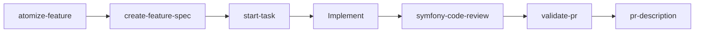

# Pipeline — Feature delivery with AI harness

## Stages

| Stage | Skill | Output |
|-------|-------|--------|
| Atomize | atomize-feature | Work-breakdown plan (packages + build order) |
| Plan | create-feature-spec | `docs/specs/<slug>-spec.md` |
| Bootstrap | start-task | Branch + implementation brief |
| Build | (manual) | Code + tests |
| Quality | symfony-code-review | Structured review report |
| Acceptance | validate-pr | AC checklist vs diff |
| Deliver | pr-description | PR body on clipboard |

## Incident path

| Trigger | Skill |
|---------|-------|
| Production bug | fix-bug |
| Flaky CI test | fix-flaky-test |
| PR feedback | triage-pr-comments |
| Domain code moved | sync-domain-models |
| New API endpoint | create-endpoint |
| Context debt / drift | audit-conventions |

## Design principles

1. **Thin dispatcher + subagent** — symfony-code-review delegates to symfony-code-reviewer
2. **Invariants vs Approach** — specs separate must-hold from suggested path
3. **Read-only gates** — review skills never auto-commit or auto-push
